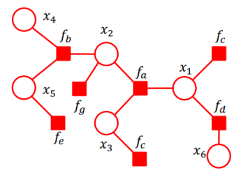

*sum-product message passing*

## Goal
Calculate marginal probability of a node.

Algorithm for inference in [[Factor graphs]] or [[Markov Random Field]].

We already know the joint probability $P(x_1, x_2 .. x_6)$. We are interested in the marginal probability $P(x_n)=\sum_{x \setminus x_n}P(x)$

## Limitations
You need a tree graph, otherwise you end up in an endless loop
Missing explain-away effect

## Why it's more effective than [[Brute Force]]
It rearranges sums and products to decrease the number of computations needed to get the result by taking the same expression out of brackets.