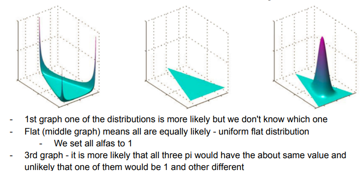

## Conjugate Prior

If the posterior distribution $p(\theta|x)$ is in the same distribution family as the prior $p(\theta)$, then prior and posterior are called conjugate distributions and the prior is a conjugate prior for the likelihood function $p(x|\theta)$.
So, if we know our prior is a conjugate prior, we don't need to calculate $posterior=likelihood*prior$ and can just assume that if it is a i.e. a beta posterior, then we add up the alphas and betas (successes/failures) based on more data. If it has a closed-form expression, we already know the maximum posterior and don't need to calculate it by using gradient descent or other numerical optimization. 

- when using conjugate prior, sequential estimation gives same result as batch estimation
- to find max posterior, you don't have to normalize $likelihood*prior$ (sampling $\times$ integration for every possible $\theta$)

## Bernoulli, Binomial
$$Bern(x|\mu) = \mu^x (1-\mu)^{1-x}$$
$$Bin(m|N, \mu) = {N \choose m} \mu^m (1-\mu)^{N-m}$$

Bernoulli is used for the outcome of a single event, Binomial for multiple Bernoulli trials.

## Beta
Can be used as a continuous prior distribution for $\mu$ parameter of a Bernoulli distribution
Has an interval of (0, 1), parameters are alpha and beta.
$$Beta(\mu|a,b) = {\Gamma(a+b) \over \Gamma(a) \Gamma(b)} \mu^{a-1} (1-\mu)^{b-1}$$
$\Gamma(a+b) \over \Gamma(a) \Gamma(b)$ is a normalizing constant.

Beta works as a conjugate prior also for Bernoulli, Binomial, negative Binomial and Geometric likelihoods, because Beta priors generate Beta posteriors.

## Gamma
Gamma prior combined with  Poisson or Exponential likelihood makes posterior also Gamma.

## Gaussian univariate
Normal prior combined with normal likelihood makes posterior also normal.
$$p(x) = \mathcal{N}(x; \mu, \sigma^2) = {1 \over \sqrt{2 \pi \sigma^2}} e^{-{(x-\mu)^2 \over 2 \sigma^2}}$$
$$\mu = {1 \over N} \sum_n x_n$$
$$\sigma^2 = {1 \over N} \sum_n (x_n - \mu)^2$$

## Categorical
Uses a [[#Dirichlet]] simplex to represent probability of categorization
![[dirichlet-simplex.png]]

## Multinomial
Uses the same $\pi$ probability vector.
How many ones, twos, threes do i get if i throw the dice N times
$$Mult(m_1, m_2 .. m_c | \pi, N) = {N \choose m_1, m_2 .. m_c} \sum_c \pi_c^{m_c}$$
## Dirichlet
$$Dir(\pi|\alpha) = { \Gamma(\sum_c \alpha_c) \over \Gamma(\alpha_1) .. \Gamma(\alpha_c)} \prod_{c=1} \pi_c^{\alpha_c - 1}$$
A distribution over points $\pi$ in K dimensional simplex ($\sum_{i=1}^K x_i = 1$)
Used to express our prior beliefs about $\pi$ parameter of a categorical distribution.
Dirichlet is conjugate prior for Categorical likelihood.

## Exponential family
* NormalGamma, Normal, Bernoulli, Beta, Dirichlet
Each exponential distribution can be a conjugate prior, which means the posterior can be calculated more easily using statistics $N$
![[exponential-family.png]](assets/exponential-family.png)
