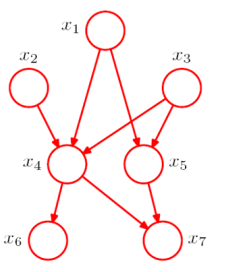

Graph corresponds to a factorization over a joint probability distribution over a set of random variables.
Variables are nodes, but they don't say what's their probability.
They are a recipe to build complex models from simple distributions.

