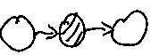
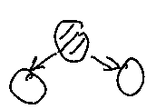
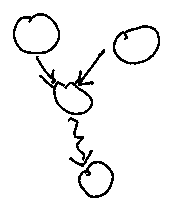

* any inactive structure on the path makes the whole path inactive
* if all paths are inactive, variables are guaranteed to be independent

<iframe width="600" height="350" src="https://www.youtube.com/embed/yDs_q6jKHb0" title="YouTube video player" frameborder="0" allow="accelerometer; autoplay; clipboard-write; encrypted-media; gyroscope; picture-in-picture" allowfullscreen></iframe> 
Let's split nodes in BN into three subsets, A, B and C.
Any path from node in A to a node in B is blocked by C, if there is arrow on the path meeting:
1. head to tair or tail to tail node from C

2. or head to head at a node not from C, that also does not have any descendant in C

If all paths are blocked, this implies conditional independence.